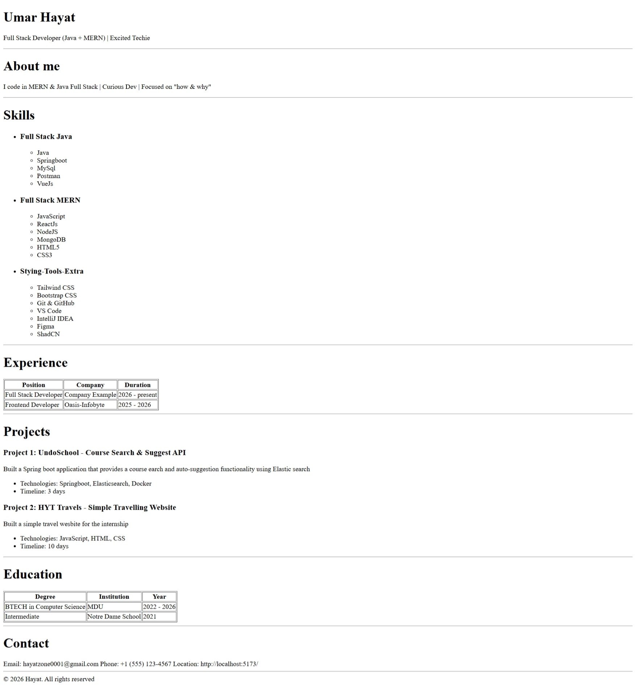

# Resume



---

# How to setup project locally

- Run the following command into your terminal

```cmd
git clone https://github.com/6116hayat/HTML-Resume.git
```

- Once the repo is cloned
- Open the folder in your preferred IDE
- Then Start the live server
